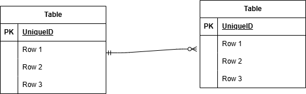

## アプリケーション名

お問い合わせフォーム

## 環境構築

Dockerビルド
・git clone git@github.com:yuukuroda/kuroda-kadai1.git
・docker-compose up -d --build

Laravel環境構築
・docker-compose exec php bash
・composer install
・cp .env.example .env、環境変数を以下に変更
```
　　DB_CONNECTION=mysql
　　DB_HOST=mysql
　　DB_PORT=3306
　　DB_DATABASE=laravel_db
　　DB_USERNAME=laravel_user
　　DB_PASSWORD=laravel_pass
```
・php artisan migrate
・php artisan key:generate
・php artisan db:seed

開発環境
・お問い合わせ画面：http://localhost
・ユーザー登録：http://localhost/register

##使用技術（実行環境）
・
・
・
・mysql:8.0.26
・nginx:1.21.1

## ER 図


